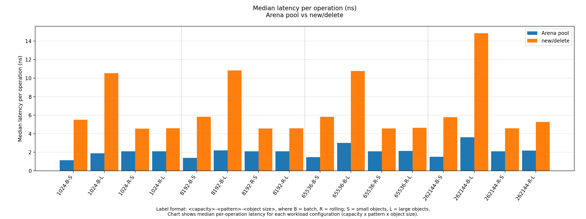
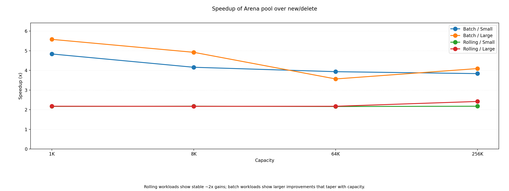
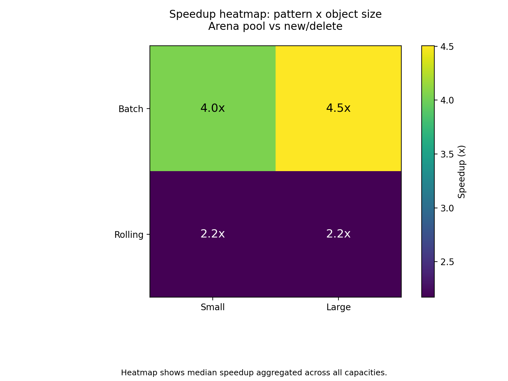

# Arena Pool

[](https://github.com/grudshtein/arena-pool/actions/workflows/ci.yml)


Arena Pool is a high-performance fixed-capacity memory pool implemented in modern C++20.

It provides deterministic allocation latency by carving all storage from a single contiguous arena and serving objects through pointer recycling, avoiding the overhead and variability of new/delete.

The library is header-only (`include/arena_pool.hpp`), testable under sanitizers, and ships with reproducible benchmarks and analysis scripts.

## Overview

Arena Pool is designed for workloads that repeatedly allocate and free objects from a known upper-bound, such as queues, schedulers, matching engines, task pools, and component graphs.

Key characteristics:
- Fixed-capacity arena; all memory is reserved up front.
- O(1) allocate/deallocate; implemented as a LIFO free-list.
- Strict safety checks:
    - double-free detection
    - foreign-pointer detection
    - nullptr deallocate detection
- No construction or destruction: the pool manages raw storage only.
- Header-only and dependency-free.

## API

```
arena_pool<T> pool(capacity);

T* allocate() noexcept;
void deallocate(T* ptr) noexcept;

std::size_t capacity() const noexcept;
std::size_t used() const noexcept;
bool empty() const noexcept;
bool full() const noexcept;
```

Design choices:
- Non-movable and non-copyable (the arena owns raw storage).
- Does not call constructors/destructors.
- Pointer stability: addresses never change during the arena’s lifetime.

## Build

### Linux / macOS / Windows (CMake)
```bash
cmake -B build -DCMAKE_BUILD_TYPE=Release
cmake --build build -j
```

Produces:
```bash
build/tests     # gtest test suite
build/bench     # benchmark generator
```

## Benchmark
Benchmarks compare `arena_pool<T>` vs `new`/`delete` across:
- Capacities: 1K, 8K, 64K, 256K
- Patterns: batch / rolling
- Object profiles: small (16B), large (256B)
- 100 million operations per run

Testbed: AMD 7950X, Ubuntu 24.04, Clang 18, -O3 -march=native

## Results:



Arena Pool delivers 1.1–3.7 ns per operation, compared to 4.5–15 ns for `new`/`delete`, depending on workload and object size.



- Rolling workloads: consistent 2x speedup
- Batch workloads: 4–6x for small/medium capacities, tapering at larger sizes



- Batch + large objects: highest gains (4.5x)
- Rolling cases: stable 2.2x across profiles

## Tests

Unit tests (gtest) verify:
- capacity and accounting
- empty/full semantics
- pointer validity
- detection of null, foreign, and double frees
- stress behavior under repeated allocate/deallocate cycles

Run with:

```./build/tests```

## Notes

- Arena Pool is intentionally minimal, focusing exclusively on fixed-capacity pointer recycling.
- Object construction/destruction is left to the user to avoid unnecessary overhead.
- Debug-mode assertions catch misuse; release builds take fast paths.
- Suitable for bursty, predictable, or latency-sensitive workloads.